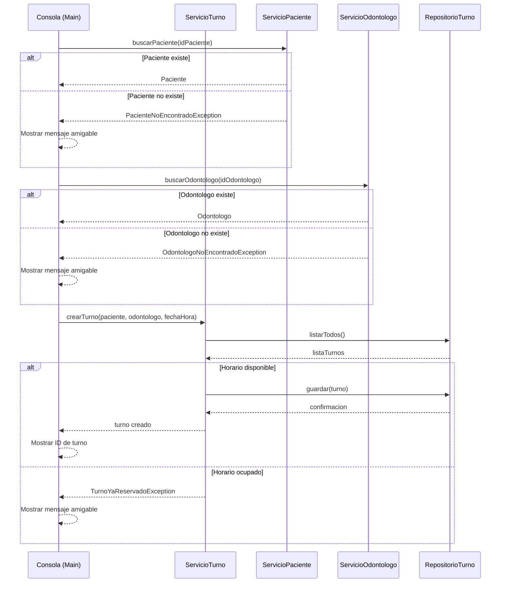
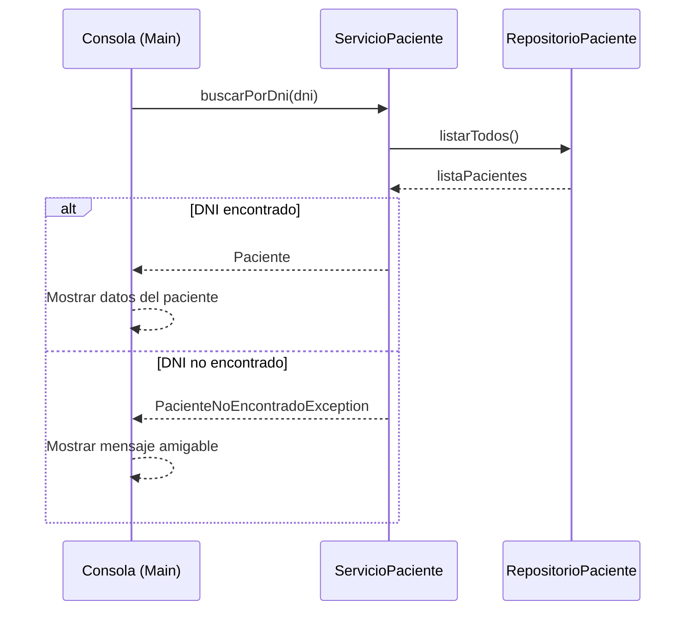

# Diagramas de Secuencia - Entrega 3

## Caso de Uso 1: Alta de un nuevo turno

```mermaid
sequenceDiagram
    participant UI as Consola (Main)
    participant ST as ServicioTurno
    participant SP as ServicioPaciente
    participant SO as ServicioOdontologo
    participant RT as RepositorioTurno

    UI->>SP: buscarPaciente(idPaciente)
    alt Paciente existe
        SP-->>UI: Paciente
    else Paciente no existe
        SP-->>UI: PacienteNoEncontradoException
        UI-->>UI: Mostrar mensaje amigable
    end

    UI->>SO: buscarOdontologo(idOdontologo)
    alt Odontologo existe
        SO-->>UI: Odontologo
    else Odontologo no existe
        SO-->>UI: OdontologoNoEncontradoException
        UI-->>UI: Mostrar mensaje amigable
    end

    UI->>ST: crearTurno(paciente, odontologo, fechaHora)
    ST->>RT: listarTodos()
    RT-->>ST: listaTurnos

    alt Horario disponible
        ST->>RT: guardar(turno)
        RT-->>ST: confirmacion
        ST-->>UI: turno creado
        UI-->>UI: Mostrar ID de turno
    else Horario ocupado
        ST-->>UI: TurnoYaReservadoException
        UI-->>UI: Mostrar mensaje amigable
    end
```

## Caso de Uso 2: Busqueda de paciente por DNI

```mermaid
sequenceDiagram
    participant UI as Consola (Main)
    participant SP as ServicioPaciente
    participant RP as RepositorioPaciente

    UI->>SP: buscarPorDni(dni)
    SP->>RP: listarTodos()
    RP-->>SP: listaPacientes

    alt DNI encontrado
        SP-->>UI: Paciente
        UI-->>UI: Mostrar datos del paciente
    else DNI no encontrado
        SP-->>UI: PacienteNoEncontradoException
        UI-->>UI: Mostrar mensaje amigable
    end
```
